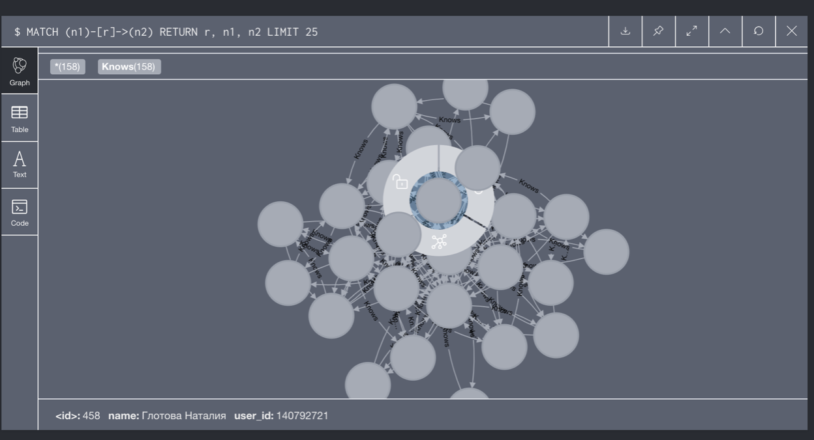

# Группа 4. VK_Teammates

## Выбранный источник данных

- В качестве источника данных мы выбрали социальную сеть "Вконтакте"
- Вершинами графа являются пользователи социальной сети
- Две вершины графа соединины друг с другом в случае, если пользователи находятся друг у друга в друзьях
- Для сбора данных мы использовали библиотеку vk_api для Python

## Результаты сбора данных

В результате сбора данных мы получили граф, с 663 вершинами и 14064 ребрами.

После сбора данных мы создали матрицу связей и файл с именами и ID людей социальной сети. Затем, мы выгрузили данные в СУБД neo4j

## Визуализация данных

Мы использовали для визуализации данных neo4j

Пример, как это выглядит:

В файле `database_neo4j.csv` можно ознакомиться с базой данных, которую мы сделали в neo4j